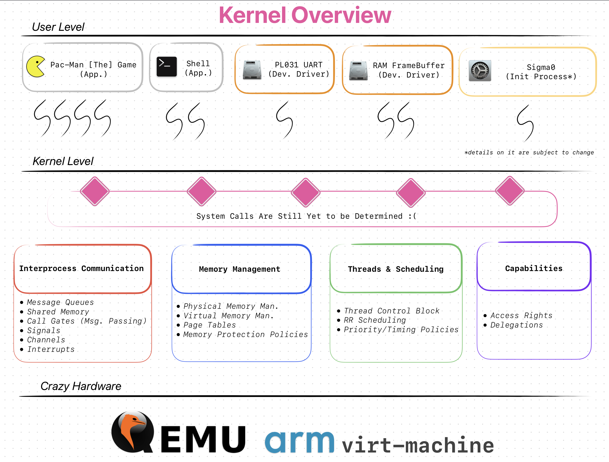

> **Warning!** Almost _nothing_ is complete yet. Everything here is experimental AND
> in VERY ACTIVE development. Proceed with caution.

## **Motivation**

Computers are _weird_. Weird in the sense that they feel magical if you don't 
know how they work. If, and when, you start learning how it works, that magical
feeling fades away. You will either end up with "Wow! This is brillaint" or 
"Wow... this is shit."

So, you have basically _two_ options:

* **Take the blue pill:** Continue using the computer like normal. Magical feeling!
* **Take the red pill:** Go on a learning frenzy. _Risk of ending up as mad men +45%_

In case it wasn't obvious yet, I _took_ the latter.

Basically, I wanted to learn more about "computers". Working on the relatively 
high-level software is pretty fun, but I have a bad habit of ending up looking
at low-level internels and workings of stuff.

> "Oh, so my calls to `malloc()` and `new` ends up calling the syscall `mmap()`?
> Let's check it's implementation.. Oh, what's `VMA`? What's a `MMU`? What's a
> `TLB`?? What's the `TCR` and the `MAIR`??? How did I get here? Why am I here..
> Just to suffer..? :("

There was these layers of **abstraction** that I had no idea of! I should've
stopped there, but no. Instead, I said: "Okay. I really like the _call-of-the-void_
feeling of low-level stuff. Let's go wild and try to learn all the abstractions
by writing a 'simple' operating system. What could go wrong?" And now, here I am.

## **WesterOS**

Work-in-progress hobbyist operating system _/w "hand-made" microkernel_.
The name is from the most political & messed-up continent in the world
of Game of Thrones.[^2] I really like GoT (yeah, judge me all you want) and the
political messiness of it felt similar to my own goals with this project.
_Everything is all over the place and nothing makes sense._

This project exists only to help _me_ learn about operating systems and to have
some fun along the way. I don't claim to know much about _OS_ development. So,
the practices, design chocies and some implementations you see here WILL scare
you.

> I suggest to kepp your expectations LOW >.<

> **Important Note:** WesterOS is in _very early_ development. Stuff WILL change,
> brake or straight-up be stupid. I am still yet to define an end goal. Until
> then expect [Everything, Everywhere, All at Once](https://a24films.com/films/everything-everywhere-all-at-once).

## **Features**

* **ARM64 Microkernel design** _/w non-preemptive RR scheduling_
* **Unix-like syscalls** _(still yet to be determined)_
* **Virtual File System** _like `/dev` and `/proc` (idk if this is possible?)_
* **Virtual Memory Management** _/w 4K page sizes_ _(wow. what a feature, eh?!)_
* **CLI based interface** _/w basic shell commands like `mkdir`, `touch` & `cat`_
* **Simple userland apps** _(Hmm.. What kind of games should I "make"?)_

## **Overview**

Let's dive a bit more into inner working of things. The target machine is 
_very specific & static_. I wanted to keep it as simple as possible by supporting
only the ARM64 architecture (ARMv8) and QEMU's ARM Virt machine.

Here's the target machine.


Only the must _basic_ peripherals are defined. Sadly, this means no USB, NVME and
NIC. :( Maybe in the future?

Here's the peripherals that I _plan_ to support.

* [ARM PrimeCell RTC PL031](https://developer.arm.com/documentation/ddi0224/)
* [ARM PrimeCell UART PL011](https://developer.arm.com/documentation/ddi0183/)
* [ARM PrimeCell GPIO PL061](https://developer.arm.com/documentation/ddi0190/)
* [QEMU RAM FrameBuffer (?)](https://github.com/qemu/qemu/blob/master/hw/display/ramfb.c)

The kernel follows a simple microkernel design (like the L4-family). I wanted to
make a _simple_ kernel that is easy to understand and help me learn as much as 
possible during the process.

I initially followed the MIT's [xv6](https://pdos.csail.mit.edu/6.828/2017/xv6.html). However, when asked, people told me that it was a bit too
"naive/cheap" and would probably not help me IRL (_they are amazing people btw_).
So, I decided to take their advice and go with a microkernel design. _it also
seems more interesting o.o_

> **Warning!** My _hand-made_ microkernel design WILL trigger you. For example,
> I put the device drivers in the user space AND the scheduler inside
> the kernel space (basically not really following a "proper/acedemic" design).
> 
> Just give me some time. I am still learning as I go >.<
  
Here's an overall overview of the kernel. (TODO: Will be updated soon...)



TODO: Overall OS specifications. What is what and the future goals.


### Directory Structure
```
|-- Build              <- Compiled objects, binaries & debug files
|-- Documents          <- Reference documents
|-- Emulation          <- QEMU scripts & Device Tree Structure
|-- Kernel             <- The source code. Headers, C and C++ files
|   `-- Arch           <- Architecture related code
|   `-- Drivers        <- Driver source and header files
|   `-- Library        <- Library source and header files
|   `-- Include        <- Kernel header files
|-- Media              <- Images and other media
|-- Toolchain          <- Cross-compiling environment
|-- Userland           <- User level source code
|   `-- Dir.           <- TBD.
|-- .gitignore         <- Good ol' .gitignore
|-- Makefile           <- Makefile
`-- README.md          <- Main README
```

### Bootstrapping

TODO: How does everything starts? Why the things I do are the way they are?

State of ARM64 machine (e.g., registers) right before `kmain()`

* VBAR: `0xffff000040108000`
* Kernel Page Tables
  * Level 0 @ `0x40101000`
    * Array of 512 uint64_t's
    * Index 0 : `0x40102003`
  * Level 1 @ `0x40102000`
    * Array of 512 uint64_t's
    * Index 1: `0x40000701`
* User Page Tables
  * Level 0 @ `0x40103000`
    * Array of 512 uint64_t's
    * Index 0 : `0x40104003`
  * Level 1 @ `0x40104000`
    * Array of 512 uint64_t's
    * Index 1: `0x40000701`
* MAIR_EL1: `0xbbff440c0400`
  * Attbr 0: `0b00000000 (DEVICE_nGnRnE)`
  * Attbr 1: `0b00000100 (DEVICE_nGnRE)`
  * Attbr 2: `0b00001100 (DEVICE_GRE)`
  * Attbr 3: `0b01000100 (NORMAL_NC)`
  * Attbr 4: `0b11111111 (NORMAL)`
  * Attbr 5: `0b10111011 (NORMAL_WT)`
  * Attbr 6: `0b00000000 (Res)`
  * Attbr 7: `0b00000000 (Res)`
* TCR_EL1: `0x480100010`
  * DS: `0b0 (48 bit)`
  * IPS: `0b100 (44 bits, 16TB)`
  * T1SZ: `0b01000 (16)`
  * T0SZ: `0b01000 (16)`
  * HPDN1: `0b0 (Hierarchical permissions enabled)`
  * HPDN0: `0b0 (Hierarchical permissions enabled)`
  * TBI1: `0b0 (Top Byte used)`
  * TBI0: `0b0 (Top Byte used)`
  * AS: `0b0 (8 bit)`
  * A1: `0b0 (TTBR0_EL1.ASID defines the ASID)`
  * EPD1: `0b0 (Perform table walk)`
  * EPD0: `0b0 (Perform table walk)`
  * TG1: `0b10 (4 KiB)`
  * TG0: `0b00 (4 KiB)`
  * SH1: `0b00 (Non-shareable)`
  * SH0: `0b00 (Non-shareable)`
  * ORGN1: `0b00 (Outer Non-cacheable)`
  * ORGN0: `0b00 (Outer Non-cacheable)`
  * IRGN1: `0b00 (Inner Non-cacheable)`
  * IRGN0: `0b00 (Inner Non-cacheable)`
* TTBR1_EL1: `0x40101000 (k_l0_pgtbl)`
* TTBR0_EL1: `0x40103000 (u_l0_pgtbl)` 
* SCTLR_EL1: `0xc50839`
  * M: `0b1 (MMU enabled)`
  * A: `0b0 (Alignment fault checking is disabled)`
  * C: `0b0`
  * SA: `0b1 (SP Alignment check enabled)`
  * SA0: `0b1 (SP Alignment check enabled for EL0)`
  * CP15BEN: `0b1 (System instruction memory barrier enabled for EL0 Aarch32)`
  * I: `0b0 (Access to Stage 1 Normal memory from EL0 & EL1 are Stage 1 Non-cacheable)`
  * 

### Kernel

WesterOS kernel follows a microkernel design. Different people/orgs have
different interpretations on how a microkernel should be designed
(e.g., L4, Minix). Here I use the term _micro_ as keeping the kernel as simple
as possible. This means:

* **No drivers in kernel-space**
* **No services in kernel-space**
* **No filesystem in kernel-space**
* **No process management in kernel-space**

All of the above would needed to be implemented as user-space applications.

Kernel _will_ provide the following services & functions:

* **Memory Management** (e.g., `mmap()`)
* **Capabilities(?)**
* **Interprocess Communication** (e.g., `msgsend()`, `msgrecv()`)
* **Channels (for IPC)**
* **[POSIX] Signals**
* **Threads** (e.g., `thread_create()`)
* **Interrupts** (e.g., `intr_attach()`)
* **Clock & Time** (e.g., `gettimeofday()`)
* **Synchronization** (e.g., mutex, semaphore)
* **Schedular** (e.g. `yield()`)


The kernel requires an [initial] user image from the bootloader. This image 
should contain the first ELF executable(s) that the kernel will launch (likely
the `root task` and the `process manager`).

> Useer image can be thought as the initrd used in Linux systems.

The complete list of everything the kernel provides & inner workings of stuff
will be explained later down the road. I'm still yet to _implement_ them..

As for reference, I made high use of the following microkernels & OSes:

* [seL4](https://sel4.systems)
* [BlackBerry QNX 8.0](https://www.qnx.com/developers/docs/8.0/com.qnx.doc.qnxsdp.nav/topic/bookset.html) 

### User Space

TODO: Some fun stuff. What awaits someone one they launch the OS?

The following services are to be implemented:

* **Root Task**
  * Launches other services predefined in a file. (e.g., `services.config`)
  * Similiar to the init task on Linux systems.
  * Will be the first user space application launched by the kernel.
* **Process Manager**
  * Defines the necessarry APIs and abstractions to model a process.
  * Defines the system pathname(?) Similiar to QNX pathname manager.
  * Other programs (via libc) can spawn/launch/destroy/debug processes.
  * (should consider permissions & user rights)
* **Device Discovery**
  * Provides the necessarry APIs to enumerate devices.
  * Builds a database/structure of all the devices within the system.
  * The database/structure is built from the:
    * [ARM] Device Tree Blob given by the root task. (TODO)
* **File System Manager**
  * Provides an abstraction to the underlying filesystem. (e.g., ext2, MS-DOS)
  * Communicates with the available disk drivers. (TODO)
  * Registers all files & folders to the system pathname.

## Installation

To build & run the operating system you need three main things: `ARM GNU Toolchain`, `QEMU` and a little bit of Patience™.

It is possible to build everything on your favorite operating system. `ARM GNU Toolchain` is available on both **Windows**, **macOS** and **GNU/Linux**. However, I have NOT tested **Windows** yet. So, you are alone in that space. Sorry :(

The below steps are for **GNU/Linux (Aarch64)** hosts.

**0. Make sure you have `git` and `make`**
```bash
$ apt install git make # if using `apt`
$ pacman -S git make # if using `pacman`
```

**1. Clone this repository**
```bash
$ git clone https://github.com/TunaCici/WesterOS.git
```

**2. Download the latest `ARM GNU Toolchain`**

Navigate to [ARM GNU Toolchain Downloads](https://developer.arm.com/downloads/-/arm-gnu-toolchain-downloads) web page.

Choose the appropriate **Aarch64 bare-matel target** to download. The version _should not_ matter, so choose the latest one. However, which hosted toolchain you download DOES matter. Choose the one that is created for your OWN operating system.

For example, if your OS is **GNU/Linux (x86_64)** then you download:
```text
https://developer.arm.com/-/media/Files/downloads/gnu/12.2.rel1/binrel/arm-gnu-toolchain-12.2.rel1-x86_64-aarch64-none-elf.tar.xz
```

```bash
$ cd WesterOS/Toolchain
$ wget https://developer.arm.com/-/media/Files/downloads/gnu/12.2.rel1/binrel/arm-gnu-toolchain-12.2.rel1-aarch64-aarch64-none-elf.tar.xz
```

> It is your responsibility to verify the "integrity" and "signature" of the downloaded file. Use the **SHA256** keys provided in the downloads page.

**3. Extract the downloaded `ARM GNU Toolchain`**

Make sure to extract it while in `Westeros/Toolchain`.

```bash
$ tar -xvf arm-gnu-toolchain-12.2.rel1-aarch64-aarch64-none-elf.tar.xz
```

**4. Modify the `TOOLCHAIN_PATH` in the `Makefile`**

The `TOOLCHAIN_PATH` should point to your newly downloaded and extracted `ARM GNU Toolchain`. Since your host OS and toolchain version might be different than mine, you MUST edit the PATH variable.

If not set correctly, the `make` process WILL fail with an error message like:
```text
make[1]: Toolchain/arm-gnu-toolchain-12.2.rel1-darwin-arm64-aarch64-none-elf/bin/aarch64-none-elf-as: No such file or directory
```

So, make sure to edit the `TOOLCHAIN_PATH`.
```bash
# Open the main Makefile /w your favorite text editor
$ vim Makefile

# And change the `TOOLCHAIN_PATH` accordingly. For example..
> TOOLCHAIN_PATH=Toolchain/arm-gnu-toolchain-12.2.rel1-darwin-arm64-aarch64-none-elf

# Save & exit
```

**5. Build using `make`**

```bash
$ make all
```

The build ends with a message **Build complete. Enjoy life <3**. If you don't see it, contact me. I'll try the fix the issue >.<

## Run/Emulate

WesterOS can ONLY be run using QEMU. I have no plans to make a fully-bootable image for real-world hardware. Originally my idea was to emulate a _Raspberrry Pi 4b_, but I realized it might not that be "beginner friendly" when testing and deubgging. So, QEMU it is!

> Shameless plug time! If you want more about QEMU, visit my [QEMU_Starter](https://github.com/TunaCici/QEMU_Starter) GitHub thingy.

**0. Make sure you have `qemu-system-aarch64` installed**
```bash
$ apt install qemu-system qemu-utils # if using `apt`
$ pacman -S qemu-full # if using `pacman`
```

**1. Launch WesterOS**
```bash
$ make run
```

> As of 9 July 2023, the WesterOS is straight-up empty! So, you can't do anything except to see some very basic kernel messages on the terminal :/
> 
> Then again, WesterOS is a _hobbyist operating system_ and a _learning process_. You should really try to explore it's source code. I'm sure you will have more fun there.

## Explore

TODO: Navigate the user to another README which is basically the documentation.

[1]: https://pdos.csail.mit.edu/6.828/2012/xv6.html
[2]: https://gameofthrones.fandom.com/wiki/Westeros
